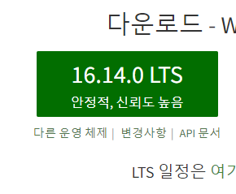
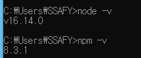
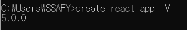
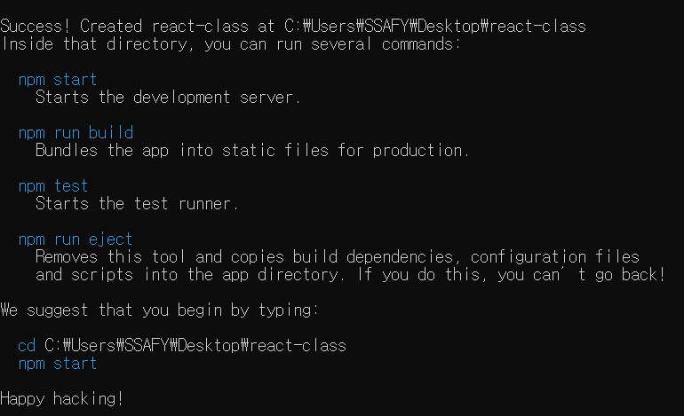
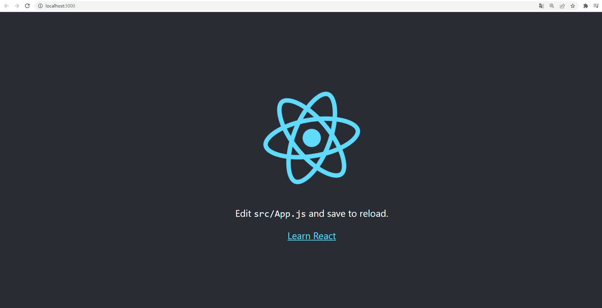

## React 개발환경 구축

1. node.js 사이트에 이동하여 가장 최신의 **안정적인 버전 설치**하기



2. 설치가 다 된 후 **node.js와 npm 버전을 확인**하기.
    버전 명이 나오면 설치가 되어있는 상태고, 뜨지 않는다면 미설치 상태입니다.




3. 위 cmd 창에서 **npm을 이용**해서 **react를 설치**합니다**. -g라는 옵션**을 주는데, 글로벌로 **어떤 곳에서든 실행할 수 있게 옵션**을 줍니다.

```plain
npm install -g create-react-app
```


4. 설치가 끝나면 해당 명령어를 통해 잘 설치가 되었는지 버전 확인하기.

```plain
create-react-app -V
```




---

1. react-app 폴더를 하나 만들어주고 해당 디렉토리로 이동.

   (주의!) 리액트 프로젝트명에는 **대문자나 특수기호 입력했는지 꼭 확인**하자. 

   > 입력시 **create-react-app . 명령어 에러 남.**

   


2. create-react-app라는 명령어를 입력하면 개발환경이 구축됩니다. 마지막에 있는 . 은 현재 경로를 의미

```plain
create-react-app .
```




## 웹앱 실행

이제 설치한 react를 실행해봅시다.

```plain
npm run start
```

npm run start 명령어로 실행할 수 있습니다. 실행하는 경로는 설치한 react 경로에서 터미널을 열어 명령어를 입력하면 됩니다. **cmd창으로 해도 되고, vs로 해도 됩니다**.



명령어를 입력하고 잠시 기다리면 **로컬호스트 3000 포트로 웹 페이지가 하나 실행**이 됩니다.

