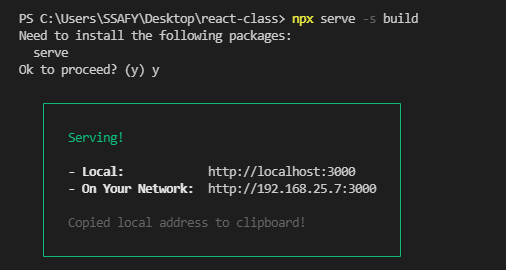

### React - 7. JS 코딩 하는 법


public 디렉터리는 index.html이 있는 곳. 

index.html에서 신경 써야 할 부분은 아래 코드 부분이다.

```html
<div id = "root" > < /div>
```

리엑트를 통해서 컴포넌트를 만들어 갈 것인대 컴포넌트는 
위 div 태그에 id가 root 태그 안에 들어가도록 create-react-app은 약속을 해 놨다.

그러면  id가 root 태그 안에 들어가는 컴포넌트 들은 어떤 파일을 수정해서 만들 수 있냐?

즉, src 디렉터리 안에 있는 파일들을 수정해서 만들 수 있다.

따라서 대부분의 파일은 src 폴더안에 만들 수 있다고 볼 수 있다.

진입 파일은 index.js 파일이다.


우리 수업은 **클래스 방식을 이용할 것**이기 때문에 **함수 방식이 아닌** **아래 오른쪽 사진** 처럼 
**클래스 방식으로 바꿔주길 바란다**.


---


### React - 8. CSS 코딩하는 법


**현재 2가지를 했다.**

1. **실습환경 구축**

2. **코드 작성해서 실행하는 것 까지 함. -> 나 이거 할 줄 알아 정도 까지 됨.**


---


### React - 9. 배포하는 법

**build 할 때**는 

```react
npm run build //치고 enter을 치면 
```

**이전에 없었던 build 라는 디렉터리가 생성**될 것이다.


Ctrl + K + F (for windows) - 자동 정렬 단축 키

build 디렉터리 안 **index.html은 읽을 수 없게 되어 있다**. 


이것은 create-react-app이 실제 제품 환경에서 사용되는 app을 만들기 위해서 이미 가지고 있는**public 디렉터리 안 index.html에** 가지고 있는 공백과 같이 불필요하게 용량을 차지하는 정보를 지워준 것이다.

우리가 **src에 작업했던 여러 파일**들도  create-react-app이 그것의 용량을 줄여주고 에러 메시지, 경고를 없애는 작업을 한 다음 index.html 파일이 로드할 수 있도록 알아서 처리해 준다.

결론적으로는 실제로 서비스 할 때는 **build 안에 있는 파일**들을 쓰면 된다. 용량을 정리해줘서 더 용량을 적게 배포 시켜준다.

```
npm install -g serve # 이 명령어는 이 컴퓨터 어디에서나 seve라는 명령어로 웹 서버를 설치 가능.

npx serve -s build # 한 번만 웹 서버를 다운로드 받아서 실행 시킬 때 build라는 디렉터리를 다큐먼트 루트로 하겠다 라는 것이 -s 옵션이다.
```



