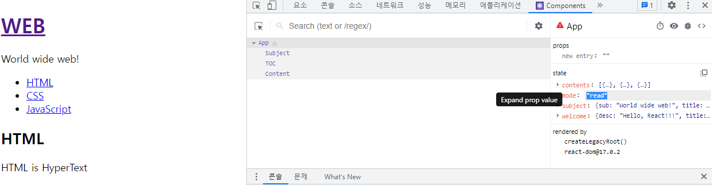
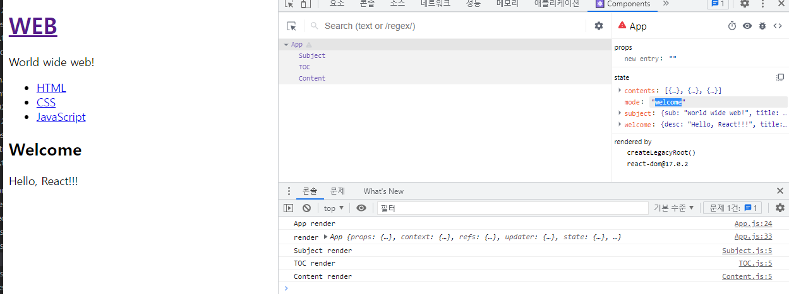

## React - 16.1. 이벤트 state props 그리고 render 함수

이번 시간에는 애플리케이션을 역동적으로 만들어주는 이벤트를 살펴볼 것이다.

그리고 **이벤트는** **props, state, 이벤트 이 3자가 상호작용**을 하면서 
**애플리케이션 역동성을 만들기 때문**에 같이 살펴본다.

우리는 아래 **WEB 부분**에 링크를 걸 것이다.

- 링크를 클릭하게 되면 지금 아래 HTML 로 나오지만 Welcome에 해당하는 메시지가 나오게 할 것이다.

- 그리고 **HTML, CSS, JavaScript 리스트를 클릭**하게 되면 
  **클릭한 것에 해당하는 Content가** 위 영역에 출력되게 할 것이다.

1. 그것을 하기위해선 먼저 **WEB 부분에 링크**를 달겠다.

   

2. 그 다음에 **우리는 리스트에 각각의 이벤트를 설치**할 것이다. (**다음 시간**에) 

   - 리스트 **링크를 클릭**하게 되면 **App 컴포넌트의 state가 바뀌고** 
     그 **바뀐 state가 Content 컴포넌트의 props 값**으로 전달 됨으로 동적으로 애플리케이션이 바뀌게 되는 것을 구현하게 우리의 목표이다.
   - 이벤트를 무턱대는 것은 수업에 복잡하기 때문에 이번 시간에는 state를 먼저 셋팅하겠다.

3. App 컴포넌트의 **state 값에다가 mode 기본 값으로 welcome을 줄 것**이다.

4. **mode가 welcome 일 때** Content **영역에 표시할 텍스트도 아래와 같이 지정**하겠다.

5. 리엑트에서는 **props, state 값이 바뀌**잖아요 ?  
   - 그러면 **그 state를 가지고 있는 컴포넌트에 render 함수가 < 다시 호출 >** 된다. 
   - 그리고 **그 render 함수가 다시 호출됨**으로 
     그 render 함수 **[ 하위 컴포넌트의 render 함수도 싹 다 호출 ]**된다. **그러면 화면이 다시 그려지는 것**이다.

6. **render() 함수가 하는 일**은 **어떤 html을 그릴것인가 를 결정**하는 것.

7. 우리는 **mode의 값에 따라 만들어지는 랜더링 결과가 달라지게** 아래와 같이 **조건문을 사용**해 보겠다.

8. 위 **_title 값**을 Content 컴포넌트의 **props 데이터 값으로 지정**해 준다.

9. 위 처럼 수정해 주고 나서 **실행해 보면** 아래와 같이  **welcome 모드의 title, desc 값이 보여지게** 된다.

10. **각 컴포넌트 render() 함수 밑에 consle을 찍어 볼 것**이다.

- console.log() 코드를 넣고나서 실행하여 개발자 도구 콘솔을 보면 아래와 같다.

  

- Subject , TOC, Content가 **차례대로 호출되는 것을 볼 수 있다**.

---

## React - 16.2. 이벤트 설치

App.js 에 일단 Subject 컴포넌트를 **잠시 주석**을 하고 아래와 같이 Subject 컴포넌트 안 html 코드를 넣어 주면서 **onClick 이벤트를 심어주고**, a태그는 클릭했을 때 **href 가 가르키는 페이지로 이동한다라는 기본적인 동작 방법**이 있다. 바로 이 기본적인 동작 방법을 못하게 하고 싶어서  **e.preventDefault(); 를 추가**했다.

- **이벤트를 설치하는 방법**을 알게 되었고,  **이벤트가 발생했을 때 그 태그의 기본적인 동작을 막는 방법**도 배웠다.

---

## React - 16.3. 이벤트 에서 state 변경하기

- 우리가 지금 하고자 하는 것은 위 a 태그를 클릭했을 때 
  **App 컴포넌트의 mode 값을 welcome으로 바꾸고** 싶다.
- this.state.mode = 'welcome'; 으로 할 경우 **리엑트는 state 값이 바뀐줄 모른다**.

따라서, 아래와 같이 리엑트가 시키는 대로 this.setState({인자}) 인자에 
**mode : 'welcome'으로 바꾸고 싶다**라고 **지정**하면 된다.

---

## React - 16.4. 이벤트 bind 함수 이해하기

- 이번 시간에는 **.bind(this) 에 대해 알아 볼 것**이다.

- onClick 이벤트의 function 함수에는 this가 아무 값이 없다.

  

- **.bind(this)에서 this는** App 컴포넌트 자체를 가르키는 객체를 
  이 아래 function 함수 내에 **this는 그 객체가 되게 하는 것**.
  

---

## React - 16.5. 이벤트 setState 함수 이해하기

이번 시간에는 state 값을 직접 변경하면 안되고 **this.setState() 함수의 형태로 변경해야 하는 이유**를 설명한다.

즉, **동적으로 state 값을 바꿀때**는 this.state.mode -> 이렇게 하면 절대 안된다.

이유는 리엑트에서는 this.state.mode 이렇게 바꾸려고 하면 **리엑트 입장**에서는 **몰래 바꾼 것**이다.

그래서 값이 바뀐지 모르니 **랜더링 된지 모른다**.

항상 **state 값이 바뀌면**  **this.setState() 함수로 우리가 바꿔줘야 하는 것을 잊지 말자**.

render() 함수 위 constructor(props){ } 에서는 편하게 하셔도 괜찮다.

---

## React - 17.1. 컴포넌트 이벤트 만들기

1. 이전 시간 까지 작성했던 아래 코드 **39~50번째 줄을 주석**처리 하고, **Subject 컴포넌트 태그를 살린다**.

2. 우리가 만들려는 Subject 컴포넌트는 **onChangePage 라는 이벤트가 있어서** 이 컴포넌트 안에서 링크를 클릭 했을 때 **이벤트에 설치한 함수를 호출하게 만들려고 하는 것**이다.

- 사용자는 아래와 같이 코드를 수정한다.

onChangePage 라고 하는 함수는 어떤 형태로 Subject에 전달하게 되나? 

- props로 전달 된다.

  

3. **Subject.js** 에 가서 아래와 같이 코드를 수정

- **onChangePage 라는 이벤트를 우리가 만들고 함수를 설치**해주면, 그 이벤트가 발생되었을 때 **props로 전달**된 **onChangePage 라는 함수를 호출**해 주면 되는 것이다.

  

  **코드를 수정하고 처음 상태**                                                                                            **WEB 링크를 클릭시 mode가 변경된 모습**

|  |  |
| ------------------------------------------------------------ | ------------------------------------------------------------ |

- 마지막으로 기존에  **39~50번째 줄을 주석** 한 것을 지워 버리고 다음 강의로 이동.

---

## React - 17.2. 컴포넌트 이벤트 만들기

이전 시간과 과정은 동일하다.

1. TOC 컴포넌트 안의 **리스트를 클릭**하게 되면 아래 **Content 부분에 관련된 내용**이 나오게 하고 싶다. 

일단 App.js에 아래와 같이 코드를 수정해 준다.

TOC.js에도 아래와 같이 코드를 수정해 준다.

**현재는** 따라서 mode가 **해당 리스트를 누르**면 **read 모드로 바뀌게만 된다**. 

**다음 시간에** 리스트를 클릭시 **해당 리스트에 관련된 title과 desc가 나오게 하는 것을 배울 것**이다.

---

## React - 17.3. 컴포넌트 이벤트 만들기

- 이번 시간에는 우리가 리스트를 클릭한 컨텐트가 **본문에 표시되게 해 볼 것**이다.

1. 먼저 아래와 같이 App.js 에 코드를 추가해 준다.

현재 **contents 배열에 있는 id 값**과, **선택 되어진 content_id 값이 같다면** 
해당 id에 해당하는 title, desc를 **_title, _desc 변수에 할당하고 반복문을 나와 주게 한다**. 

2. App.js에 아래와 같이 코드 수정

   

3. TOC.js에 아래와 같이 코드 수정

a태그가 가지고 있는 접두사가 data-라고 시작하는 속성은  **dataset이라고하는 특수한 것을 통해 접근**할 수 있다.

그러면 현재 **해당 리스트를 클릭할 때마다** 해당 리스트 id 번호가 App.js onChangePage 이벤트 함수 **id 인자로 잘 넘어온다**.

하지만 본문에는 변화가 없어서 개발자 도구로 봤더니 **selected_content_id는 아래와 같이 문자열** 이였다.

**contents 배열**에 **id 속성 값의 type은 숫자**여서 **둘이 데이터 형식이 다르다**.

따라서 리스트를 **선택한 id 값을 숫자 형태로 형 변환**을 해 주면 된다.

아래와 같이 수정을 해주면 **해당 리스트를 클릭한 것**에 대해 **본문이 잘 바뀌는 것을 확인할 수** 있다.

**2번째 방식**으로는 **TOC.js에 아래와 같이 코드를 수정**한다.

**data-id 속성을 지우고** **< bind에 인자로 data[i].id를 추가해 줌 >**으로서 **아까와 실행 결과는 똑같다**.

또한 **bind 인자**가 **만약 bind(this, data[i].id, 10) 인경우** **15째 줄 function 함수의 인자로는 ( id, num , e ) 로 받을 수** 있다.

