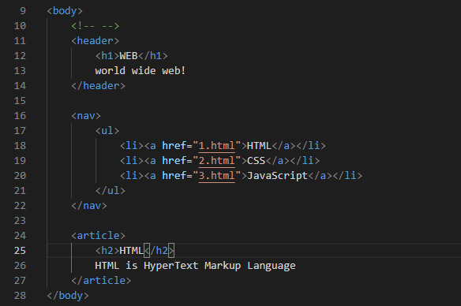

## React - 10. 리엑트가 없다면

**컴포넌트를 만드는 방법을 배울 것이다. 정말 중요 함.**


이 정도면 우리가 관리할 수 있는 수준. 그런대 상상으로 **nav 태그안 코드가 1억줄 이라고 상상**을 해 보자.

**그러면 우리 눈에 코드가 한 눈에 안 들어올 것**이다.

그래서 예를들어 아래 코드가

```html
<header>  
        <h1>WEB</h1>
        world wide web!
</header>
```

아래 와 같은 코드로 바뀌어도

```html
<Subject></Subject>
```

웹 페이지에는 **똑같이 표현**되면 얼마나 좋을까? **그것을 해주는 기술이 React**다.


---

## React - 11. 컴포넌트 만들기1


이번 시간에는 순수한 HTML로 짠 코드를 리엑트로 잘 정리정돈 하는 작업을 해 볼 것이다.


**컴포넌트는 반드시 하나의 최상위 태그**로 시작해야 한다.  --> 반드시 기억

아래 코드에서는 <header> 태그가 최상위 태그이다.


그리고 나서 **아래와 같이 App 부분에 클래스명 태그**로 하고나서


**실행해 보면 아래 결과와 같다.**


**React**가 저 <Subject></Subject> 코드를 처리한 다음 **웹 브라우저가 알아 들을 수 있는 Subject 클래스 안에있는 태그들로 바꿔준 것**이다.

또한, 아래 코드는 자바 스크립트와 거히 비슷한대 


태그들이 그대로 즉 ->  "<div className = \"App\">" 이렇게 태그들을 자바스크립트 문법으로 문자열로 감싸 주는게 까다롭기 때문에 **페이스북에서 만든 컴퓨터 언어가 JSX**이다.

그래서 **우리가 JSX 로 코드를 작성** 하면  그것을 **create-react-app 이 알아서 자바스크립트 코드로 Convert해** 주는 것이다.  -> 이 정도만 상식적으로 알아두면 좋겠다.


---

## React - 11.2 컴포넌트 만들기2

​                                           **컴포넌트 적용이 안된 것**                                                                                                 **컴포넌트 적용된 코드**

|  |  |
| ------------------------------------------------------------ | :----------------------------------------------------------: |

우리가 만든 **오른쪽 코드**와, 엉망 진창이 된 **왼쪽 코드**를 보면 우리 사람 입장에서는 차이가 심하겠나요?

그래서 우리가 **컴포넌트**를 바라보는 첫 번째 시각은 **정리 정돈의 도구**로 보셨으면 좋겠다.


---

## React - 12. props


Subject라는 태그는 여러번 써도 **언제나 똑같은 결과를 보여준다**. 아쉽지 않나요?

우리가 알고있는 아래 **링크 태그**를 봅시다.


- href **속성이라는 것을 통해 각각의 링크 주소를 표현**하고 있다.

- 즉, **태그 이름**이라는 **공통점**과 **속성이라는 차이점**을 통해서 **재사용 성이 굉장히 높은 부품**을 만들 수 있게 되는 것이다.

먼저 [https://reactjs.org/docs/components-and-props.html](https://reactjs.org/docs/components-and-props.html) 링크로 이동해 props 예시를 한번 봐 보자.

그러고 나서 **아래와 같은 코드로 수정하고 실행해 보면** 결과는 **아까와 똑같이 나온다**.


**똑같은 결과**지만 **내부적으로는 더 효율적**으로 바뀌었다. 이런 것을 **리펙토링** 했다.

**왜 더 효율적** 인가?

- 위 **Subject라는 컴포넌트**는 **언제나 똑같은 결과만 내주는 그런 아이**였지만 

- 아래와 같이 코드를 수정하게 되면 **title이라는 값과 sub라는 값**이 **Subject 컴포넌트에 입력 값**이 되어서 
  **< 그에 따라 달라지는 출력 값을 화면에 표시 >**하게 된다는 것이다.


####                                                                [ 실행 결과 ]


- 이제는 **리엑트의 prop를 받아서** 그것을 바탕으로 **서로 다른 결과를 만들어내는 **
  **훨씬 더 똑똑한 컴포넌트를 만들 수 있다**.


---

## React - 13. React Developer Tools

**현재의 상태를 알아내는 도구**를 배워볼 것이다.

**앱의 상태를 알아 볼 수 있는 그런 도구**들이 https://chrome.google.com/webstore/detail/react-developer-tools/fmkadmapgofadopljbjfkapdkoienihi/related?hl=ko 여기 링크에 가 보시면 크롬 확장 페이지로 가고 

아래와 같은 **확장 프로그램을 설치** 후 
혹시나 모르니 브라우저를 모두 끄고 다시 키시면 더 안전하게 실습을 할 수 있다.


그 후, 리엑트를 npm run start로 실행한 후 개발자 도구에서 Elements(요소) 부분을 보면 


위 header 태그 부분이 **Subject 컴포넌트 영역에 해당**된다.

이것은 실제로 웹 브라우저가 이해하는 태그이고, **우리가 작성한 자바 스크립트 코드**는 아래와 같다.


- 우리가 실제 물리적인 태그를 보는 것이 아니라, 리엑트 상에 컴포넌트를 보고 싶은 경우가 있다.

- 따라서 우리가 설치한 프로그램에 의해서 개발자 도구에서 **Components 탭을 클릭**하면 아래와 같이 우리가 만든 앱에 **컴포넌트들을 보여주는 도구**들 이다.


- 실제 태그를 보고싶을때는 Elements(요소)를 보면 됨.
- **리엑트를 분석**하고 싶을 때는 **Components탭**을 쓰면 된다.

- 또한 props 부분에 실시간으로 값을 바꿀 수도 있다.


- 바꾸고 나서 Enter을 치면 웹 브라우저 기존 결과가 방금 **props 에서 수정한 sub 값**으로 **바뀐 결과**

  


---

## React - 14. Component 파일로 분리하기

이번 시간에는 **컴포넌트를 정리**하는 **가장 큰틀에 정리 작업**을 해 볼  것이다.

- 우리가 작업한 **App.js 를 보면** 여러가지 컴포넌트들이 정리되어 있는대, 
  **하나의 파일 안에 1000개의 컴포넌트가 있다면** **얼마나 복잡**하겠냐.

- 그리고, App.js 파일에 있다보니 , **다른 파일에는 App.js 파일 안 컴포넌트를 가져다 쓰기가 어렵다**는 것.

- 그래서 지금 할 것은 **각각의 컴포넌트 별로 별도의 파일로 정리 정돈**을 해 볼 것이다.


1. 먼저 **src 디렉터리 안**에 **components 디렉터리**를 만든다.

2. components 디렉터리 안 **TOC.js 파일**을 만든다.

3. App.js 파일에 **TOC 컴포넌트 코드를 복사**한다.

4. TOC.js 파일안에 복사한 코드를 붙여 넣는다.

   


- 위와 같이 빨간줄이 뜨는 이유는 **컴포넌트 클래스가 사용**하고 있는대 **그 클래스를 로딩 하는 코드가 없다는 경고 메시지를 우리에게 보여주고** 있다.

5. TOC.js 파일 안 TOC 컴포넌트를 쓰기 위해서 **아래와 같은 코드를 추가**해 주면된다.

   ```react
   import { Component } from 'react'; // react라는 라이브러리에서 컴포넌트 클래스를 로딩 한 것.
   ```

   


6. **나는 어떤 것을 외부에서 사용할 수 있게 허용**할 것인가를 아래 코드 **TOC.js 파일 맨 아래에 추가**해 주면 됨.

   ```react
   export default TOC; // TOC.js를 가져다 쓰는 쪽에서 'TOC 라는 클래스'를 가져다 쓸 수 있다.
   ```


7. TOC.js 파일 안의 코드를 사용하려면 
   **App.js 파일에 맨 위**에 아래와 같은 코드를 추가 해 주고, **기존 TOC 컴포넌트를 지워준다**.

   ```react
   import TOC from './components/TOC' // components 디렉터리 안 TOC.js를 TOC 명으로 가져온다.
   ```

   ##### [ App.js에 TOC 컴포넌트를 지운 코드 ]


- 결과는 당연히 똑같다
- 하지만, 코드는 훨씬 더 좋아졌다. 코드를 나눠 주었기 때문.

- 나머지 **Subject, Content 컴포넌트도 마찬가지 방식**으로 해 보아라.

##### [ 최종 App.js 안 코드 ]


- 우리의 코드가 **훨씬 더 간결해 짐**
- 우리가 필요한 컴포넌트를 **훨씬 더 빨리 찾을 수 있고** App.js 가 아니라 **다른 리엑트 파일에서도 components 디렉터리 안 컴포넌트**를 사용해서 **빠르게 빠르게 Application을 만들어 갈 수 있다**.


---

## React - 15.1. State 소개

- State라는 개념은 props와 함께 봐야한다. 

**props는** 사용자가 **컴포넌트를 사용하는 입장(사용자)**에서 중요한 것.

**state는** prop의 값에 따라 **< 내부에 구현에 필요한 데이터 >**를 말한다.


---

## React - 15.2. State 사용

현재 App 컴포넌트 안 Subject 컴포넌트에 props의 값이 아래와 같이 하드코딩 되어 있다.


- 하드 코딩 되어있으니 보기 싫다.  따라서 **하드코딩된 props 값**을 **state로 만들고 state 값을 Subject 컴포넌트의 props로 전달**할 것이다.

- 지금 할 것은 state 값을 초기화 할 것이다. 초기의 값을 현재 위 코드 Subject 컴포넌트 태그의 props 값으로 할 것이다.

- 어떠한 컴포넌트가 실행될 때 **render 라는 함수보다 먼저 실행**되면서,
  **그 컴포넌트를 초기화 시켜주고 싶은 코드**는 **constructor안에 다가 코드를 작성**한다.


- 따라서 위와같이 **state 값을 먼저 초기화** 시켜주고, **Subject 태그에 state 값을 사용**하여 **이전과 같은 결과를 웹 브라우저 상에서 보여주게** 된다.

#### 정리

- App.js 를 사용하는 파일이 index.js 다.
- index.js를 보면  아래 코드와 같이


App 컴포넌트를 실행하는 부분이 있는대, 이 코드를 보고있는 **우리 입장**에서는 **저 코드가 내부적으로 state 값이 subject 가 있는지 우리는 모른다**. 외부에서 알 필요 없는 **정보를 철저하게 은닉, 숨긴**다.

- App이 **내부적으로 사용할 상태**는 **state라는 형태로 사용한다는 것이 핵심**이다.

- 그렇게 만들어진 **state 값을 Subject 라는 컴포넌트에 props 값**으로 줬다.

- **상위 컴포넌트의 상태**를 **하위 컴포넌트에게 전달**하고 싶을 때는 **상위 정보 state 값**을
  **하위 컴포넌트 props의 값으로 얼마든지 전달 가능**하다는 것이다.

  

---

## React - 15.3. Key

이전에 배운 state는 subject 자식 컴포넌트의 값 하나였는대 여러개의 값을 다룰 때는 사용법이 다르다.

**TOC 컴포넌트**는 현재 **글 목록**이다.
TOC 안에있는 데이터를 **App 내부 state를** **TOC 주입해 주는 것을 통해** **자동으로 데이터를 바뀌게 해 볼 것**이다.

**TOC 부모가 가지고 있는 state를 이용**해서 **TOC 내부 데이터가 바뀌게 해 볼 것**이다.


- **TOC 컴포넌트**에 **부모가 가지고 있는 contents를 주입**하고 싶다면
  **위 코드와 같이 {this.state.contents} 로 주입**해 준다.

​                                                    [ TOC.js로 가서 아래와 같이 코드를 수정해 준다. ]


- 이렇게 수정하고 실행하면 **이전과 똑같은 상태**가 된다.

- 그런대 하나의 문제점이 있다. 위 코드 10번째 줄을 보면 자동으로 elements를 생성하고 있다.
  이렇게 여러개의 elements를 자동으로 생성하는 경우는 
  아래와 같이 콘솔창에 에러가 나있는 것을 확인할 수 있음.


따라서 목록을 자동으로 생성할 때는 아래와 같이 key 코드를 추가해 주면 된다.


```react
lists.push(<li key={ data[i].id}><a href={"/content/" + data[i].id}>{data[i].title}</a></li>);
```

**key 값은** 각각의 목록들과 구분할 수 있는 **식별자를 넣어주면 된다**.

이것은 **리엑트가 내부적으로 필요해서 요청하는 것**이기 때문에 **그러려니 하며 넣어주면 된다**. 
이제 **다시 저장하고 실행**해서 개발자 도구 콘솔창을 확인해 보면 **아래와 같이 에러가 없는 것을 볼 수 있다**.


- 이것도 우리가 주의를 가지며 기억할 내용이다!


#### [ 정리 ]

1. **App 컴포넌트 입장**에서는 내부적으로 **state 라는 내부정보를 사용**했고, 
   그것을 **자식에게 전달할 때는 props 라는 것을 이용**하여 전달했다.
2. App의 입장에서는 **TOC 자식 컴포넌트가 내부적으로 어떻게 돌아가는지 [ 알 필요가** **없다 ]**.
   data라고 하는 props로는 **어떤  형태의 정보를 전달하면 되는가** 라고하는 **사용자의 입장에서 알아야 될 것**만 딱 알면 된다 라는 것도 의미를 이해하자.

