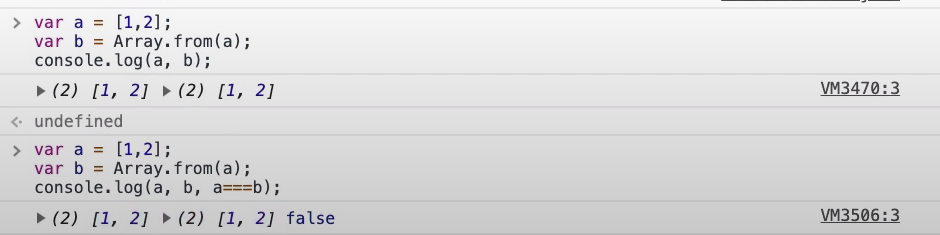
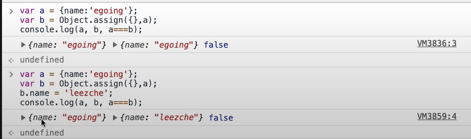

## React - 18. 베이스 캠프

App 이라는 **상위 컴포넌트**가 TOC 라는 **하위 컴포넌트에게 값을 전달**할 때는 **props를 사용**

하지만 **TOC를 클릭**했을 때 **상위 컴포넌트에게 selected_content_id 값을 바꾸려 하면** 이벤트를 구현함으로 그 이벤트가 실행 되었을 때 상위 컴포넌트의 state값을 호출함으로 **상위 컴포넌트의 state 값을 바꿀 수 있다**.

1. props는 스마트폰의 볼륨버튼이라면 사용자가 볼륨버튼을 누르면 state는 스마트폰안에서 스스로의 상태인 볼륨이 바뀌게 해놓은 모든 조치(회로,프로그래밍 등등)라고 할 수 있습니다.  
2. 상위 컴포넌트는 하위 컴포넌트에게 props를 통해 값을 전달해 **내부의 state를 바꾸기 때문**에 **컴포넌트 스스로 외부에서 전달되는 props를 변경하는 것은 금지**되어 있습니다.  또한 **하위 컴포넌트**가 **상위 컴포넌트를 동작시키려면** props를 전달하는 것이 아니라 **[ 상위 컴포넌트 안에 이벤트를 심고 ]** **그 안에 setState로 값을 바꿔야 합니다**.


---

## React - 19.1. create 구현 : 소개

- **TOC 컴포넌트**와 **Content 컴포넌트 사이** < **생성, 수정, 삭제 버튼** >을 둘 것이다.
- **생성 버튼을 누를 경우** App 컴포넌트에 **mode가 create로 바뀔 것**이다.
  - 그에 따라 **Content라는** 읽기에서 사용되고 있는 **컴포넌트**가 **글을 [ 추가할때 사용하는 컴포넌트로 바뀌고 ]** **그 컴포넌트는 form 이 들어 있을 것**이고, 그 **form에 정보를 입력하여 저장 버튼을 누르면** 
    App 컴포넌트에 **Contents의 목록**에 **새로운 컴포넌트 정보가 id, 제목, desc이 객체로 담겨**서
    **Contents에 추가**된다.
- 그럼 그에따라 TOC에  표시될 내용들이 늘어날 것이다. 그게 바로 **생성(Create) 기능**이다.


---

## React - 19.2. create 구현 : mode 변경 기능

지금 부터 **"구현"을 해 봅시다**.

1. **TOC 컴포넌트**와 **Content 컴포넌트 사이** < **생성, 수정, 삭제 버튼** >을 둘 것

2. **App.js에 아래와 같이 코드**를 작성


- 위 친구들을 컨트롤이라는 컴포넌트를 만들어서 외부에 빼 버릴것이다.

3. **Control.js 파일을 components 디렉터리 안에 만들어** 준다.
   그 후 위 **App.js에 작성한 코드를 잘라내기**를 하여 **Control 컴포넌트 return 안에 넣어준다**.


4. App.js에 잘라내기한 위치에 **Control 컴포넌트를 넣어준다**.


[ 실행 결과 ]


5. Control 컴포넌트에서 리스트 3개중에 클릭했을 때 어떤 일이 일어나게 해야한다.
   - 먼저 Control.js에 아래와 같이 코드 수정한다.


- 그 후 App.js에도 아래와 같이 코드를 수정한다.


실행해 보면 초기 mode 상태는 read 상태이다.

create, update, delete 를 클릭했을 경우 아래와 같이 **mode 값이 바뀌는 것을 볼 수 있다**.


그 다음 해야할 것은 mode에 따라서 **Content가 표시되는 영역의 컴포넌트**에 
**적당한 것으로 바뀌게 하는 작업**을 다음 시간에 배워볼 것이다.


---

## React - 19.3. create 구현 : mode 전환 기능


이번에 해야할 것은 **create를 클릭**했을 때 **Content 컴포넌트**를 **create에 사용될 컴포넌트로 교체 시킬 것**이다.

즉, App에 **mode가 create라면** Content 컴포넌트가 CreateContent 컴포넌트로 바뀌게 할 것.

App에 **mode가 read** 라면 ReadContent 컴포넌트로 바뀌게 할  것.


1. 기존에 Content 컴포넌트를 일단 ReadContent 컴포넌트로 바꿔줄 것이다.
   - 기존에 Content.js 파일명을 ReadContent 로 바꾸고 
     안에 **class 이름과 export 이름**을 **ReadContent로 수정**.


2. **App.js에서**도 Content로 써져 있는 부분을 **ReadContent** 로 수정


3. **CreateContent.js 파일** 생성


4. 기존 **App.js 에 71번째 줄 아래 코드 부분**을

   ```react
   <ReadContent title={_title} desc={_desc}></ReadContent>
   ```

   가변적으로 바뀔수 있도록 하기 위해 {\_article} 라는 변수로 처리할 것이다. 따라서 **{\_article}로 수정**


5. **App.js에** 아래와 같이 **_article 변수를 선언**하고, **welcome, read 모드일 경우** 
   _article 변수는 **ReadContent 컴포넌트를 의미**하게 초기화 시켜줌.


6. 그럼 this.state.mode 가 create 인 경우 **_article**을 **CreateContent 컴포넌트로 선언**해 주면 된다.


- 다음 시간에는 CreateContent 영역 안 **form 영역을 구현**해 봅시다.


---

## React - 19.4. create 구현 : form

이번 시간에는 **CreateContent 컴포넌트**에 **글을 추가하는 form을 완성**해 봅시다.

1. 먼저 입력 받는 태그를 CreateContent 컴포넌트 안에 추가.


2. App.js 에 가서 mode 초기 값을 create 로 수정.

   - 우리가 디버깅 하기가 좀 더 편하기 위해서.

     

3. 다시 CreateContent  컴포넌트에 가서 **10번째 줄 코드 밑**에 **아래와 같은 코드를 추가**.
   - textarea 태그는 우리가 입력할 텍스트가 여러줄 일때 스는 것.


4. 9번째 줄 코드 **form 태그를 아래와 같이 수정**한다.


- **onSubmit 이벤트**는 **form 태그 안 submit 버튼을 눌러졌을** 때 
  **submit 버튼을 포함하고 있는 form 태그에 [ onSubmit 이벤트가 실행되도록 약속 ]**되어 있다.
  - 이것은 html의 form 기능이 고유하게 가지고 있는 것이다. -> 리엑트의 기능 x.
  - **form 태그**에서는 **submit 버튼을 클릭했을 때 action 페이지로 화면이 이동** 되는 것인대 
    **리엑트를 통해 페이지 전환 없이  모든일을 할 수 있는 애플리케이션을 만들고 싶은 상태**이기 때문에
    **페이지를 바뀌게 하면 안된다**. 즉,  **e.preventDefault(); 로 페이지가 바뀌는 것을 못하게 하는 것**이다.


이제 우리가 해야할 것은 **App 컴포넌트에 contents 배열 끝**에다가 **사용자가 입력한 정보를 추가 시켜**야 한다.
그럼 **그에 따라 글 목록도 자동으로 변경**되게 될 것이다.

이에 대한 작업은 다음 시간에 하겠습니다.


---

## React - 19.5. create 구현 : onSubmit 이벤트

- submit 버튼을 클릭했을 때 onSubmit 이벤트가 실행될 것 인대, 이 이벤트가 실행되었을 때  
  **CreateContent 컴포넌트를 가져다 쓰고 있는 곳**에 **App 컴포넌트에 contents 배열 끝**에다가 
  **사용자가 입력한 정보를 추가하는 것을 배워 볼 것**이다.


1. CreateContent 에 이벤트로 설치된 함수를 실행하는 코드를 아래와 같이 추가한다.


함수의 입력 값으로 **title과 desc로 전달**된다면 **this.setState({})를 통해서 새로운 content 값을 추가**하면 된다.


2. CreateContent 의 **onSubmit이라고 하는 것에서 props를 호출할 것**이다.
   CreateContent.js에 아래와 같은 코드로 수정한다.

   

- 13~14번째 코드는 **form 에 input, textarea의 값을 가져오는 것**이다.

3.  **title과 desc 값**이 App 컴포넌트 안 **CreateContent 컴포넌트 태그**의 
   **onSubmit 이벤트의 인자로 넘어왔는지  console.log(_title, _desc);로 확인해 볼 것**이다.
   - 아래와 같이 잘 값이 넘어온 것을 확인할 수 있다. 


이제는 this.state의 **contents 배열 끝**에다가 **넘겨받은 title, desc 값을 추가해주는 작업**만 해주면 된다.


---

## React - 19.6. create 구현 : contents 변경

- 이전 시간에 **onSubmit 이벤트가 발생** 했을 때 
  **CreateContent 컴포넌트**의 **onSubmit() props를 실행**하려고 했다.

- 그럼 App.js 의 아래 코드 부분이 실행 된다.

  

- 이때 App 컴포넌트의 contents 배열 끝에다가 데이터를 추가해야 한다.
  그것을 하기 위해 기존에 contents 배열의 id 값을 쭉 읽어서 가장 큰 id 값에 +1 해 줘야한다.

- 우리는 일단 어딘가에 그 id 값을 적어 놓을 것이다. App.js에 아래와 같은 코딩 추가.


1. App.js render 함수에 아래와 같은 코드 추가

   


2. 그러고 나서 실행을 해 보면

   - 처음 실행 화면에서 **리스트가 3개가 있는 상태**를 아래와 같이 볼 수 있다.
     우리는 Create 입력 폼에 해당 데이터를 넣고 **Submit 버튼을 눌러** 보자

     

3. 누르고 나서 실행 결과는 아래와 같이 **리스트 맨 마지막 줄에 react가 추가 된 것**을 볼 수 있다.

   


- 하지만 이렇게 해서 안되는 것은 아닌대 나중에 리엑트의 성능을 개선하려면 굉장히 까다롭거나 불가능한 상황이 올 수 있다.
- 좀 더 좋은 방법은 concat이라는 것을 쓰는 것이다.

- push 는 원본을 바꾸지만, concat은 원본을 바뀌지 않는 것이다.


- **state에다가 값을 추가**할 때는 push와 같이 original 데이터를 바꾸는 것을 **쓰지말고** **concat을 써라**.

  

4. 그래서 **아래와 같이 코드를 수정**한다.

   

- **실행 결과**는 아까와 동일하게 리스트 3개에서 **맨 마지막 줄에 하나씩 추가**가 된다.


---

## React - 19.7. create 구현 : shouldComponentUpdate

우리 애플리케이션에는 **불합리한 부분을 가지고 있다**. **TOC 컴포넌트 태그** 부분을 보면 **글 목록 부분**이다.

TOC가 화면에 표시되기 위해서 필요한 데이터는 **contents가 담고 있는 배열들**이다.

TOC 의 render() 함수가 호출 되면서 TOC가 다시 그려지는 것이다.

즉, **contents 배열이 바뀌지 않았다면** 
글 목록을 표시하는 **TOC 컴포넌트의 render() 함수는 호출되는게 좋지 않다**.

지금 현재 코드에서 **contents 배열을 추가하지 않았는대도** 글 목록 부분을 클릭하게 되면 **TOC 컴포넌트의 render() 함수가 또 호출**하게 된다. 

**자기가 상관 없는 일이 일어나도** **새로 render() 함수가 호출**한다는 것은 **대단히 불합리한 상황일 수도 있다**.

**facebook 에서는 성능을 향상** 시키고 싶을 때는 **컴포넌트의 render 함수가 실행될지 실행되지 않을지**를 우리와 같은 리엑트로 코드로 작성하는 **개발자가 결정할 수 있도록** **특수한 약속의 함수를 제공**하고 있다.

```react
shouldComponentUpdate() {
	return false;
}
```

- shouldComponentUpdate 함수에는 2개의 매개변수를 가지도록 약속 되어있다.
  - (newProps, newState) 매개변수

- 위 매개변수의 뜻은 해당 컴포넌트의 props가 바뀌었을 때 바뀐 값, 
  state값이 바뀌었을때 바뀐 state 값이 들어온다.

한번 shouldComponentUpdate  함수에서 newProps.data,this.props.data를  consol을 찍어보자.

[ 해당 코드 ]


아래와 같이 그럼 create 에서 값을 입력하고 submit 버튼을 누르게 되면 오른쪽 아래에 부분사진을 보면
**newProps는** 원소가 **4개**인 배열, **this.props.data**는 **원소가 3개**인 data다.


따라서 **첫 번째 인자**로 **바뀐 값을 알 수** 있고 
this.props.data를 통해 **현재의 값을 알 수 있구나** 라는 것을 알 수 있다.


[ 정리 ]

1. **shouldComponentUpdate 함수**가 **return 이 true**면 render() 함수가 호출 되고, 
   **false 면** render함수를 호출되지 않도록 약속 되어있다.
2. **shouldComponentUpdate 함수**는 **새롭게 바뀐 값**과, **이전 값**에 대해 알 수 있다.


- 이것을 종합해 보면 TOC로 들어오는 **data라는 props의 값이 바뀌**었을 때 render가 호출되고 
  **바뀌지 않을때는 render 함수가 호출되지 않았으면** 좋겠다.

TOC.js 파일에서 아래와 같이 코드를 수정해 본다.


여기서 만약 App.js 파일에 아래 **밑줄 부분 처럼 push를 사용했다고 생각**해 보자.


그럼 **원본을 바꿔 버리기 때문**에 **이전값**과, **새로운 값이 완전히 같아버리는 문제점**이 발생한다.

따라서 원본을 사용하지 말고 **복제본 concat을 사용**해라.


---

## React - 19.8. create 구현 : immutable

**shouldComponentUpdate () 함수를 쓰실 분**만 이 강의를 보면 된다.

**원본을 바꾸지 않는다**. 즉, **불변성** 영어로는 immutable이라고 한다.

아래 코드를 보시면 내용이 같을 뿐 **완전히 다른 아이**다.




따라서 **b배열에 원소를 push 할 경우** a에는 아무런 변경 사항이 없다.


만약 여러분이 concat 말고 **push 를 쓰고 싶으면 아래와 같이 코드를 수정**해라.


- **Array.from**은 **배열일 경우**에만 쓸 수 있다.


- 객체인경우 **Object.assign**({}, 복제할 객체); 를 사용하면 된다.




- 아래 **mode 같은 경우**는 **원본의 값을 바꿔치기**(교체) 한 것이다.


이것이 까다롭다면 immutable.js를 찾아봐라.
