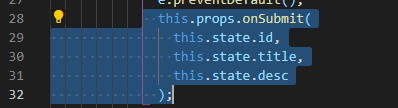

## React - 20.1. update 구현

**update 기능**은 **read 기능과 update 기능**이 **결합 되어있다고 볼 수** 있다.

일단은 **update를 하려면** create 처럼 **form이 있어야 하고**, 기존의 **contents를 수정**하는 것 이기 때문에 
**read 처럼 기존의 contents를 불러**와서 **form에다가 내용을 추가(수정)하는 작업**이 필요한 것이다.

1. CreateContent.js 파일을 복사해서 **UpdateContent.js 파일을 만들어준다**.

2. App.js에 아래와 같이 else if 문의 코드를 추가해 준다.

   

3. 기존에 render 함수에 복잡해서 getContent() 라는 함수를 만들어서 
   **기존 render 함수에 있는 코드를 잘라내기 하여 붙여 넣어**준다.

4. **getContent 함수**에서 **본문에 표시될 _article을 return** 시켜 줌으로 아래와 같이 코드를 수정해 준다.

   

5. **UpdateContent 컴포넌트가 실행**될 때 **입력 값**으로
   **현재 선택된 content**를 **UpdateContent 컴포넌트에 주입**시켜 줘야한다.
   - 따라서 우리는 **해당 content의 선택된 정보를 읽어**들이는 부분의 **기존 코드를 잘라내기**를 하여 **getReadContent() 함수에 붙여넣을 것**이다. 
     

그럼 **잘라낸 부분의 코드**에서는 **위 함수를 호출해 주며 아래 처럼 사용**할 수 있다.

6. update의 mode일 경우 해당 **컨텐트 내용**을 **_content에 담고** 이 값을
   **UpdateContent에 data로  주입** 시켜주면 된다. 코드는 아래와 같다.

7. 이제 잘 주입이 되었는지 UpdateContent.js 파일에 render 함수 부분에서 console 코드를 추가하고
   실행을 해서 **update 리스트를 클릭**하여 **콘솔창을 확인**해 보면 **아래와 같이 content data가 잘 주입이 된 것을 확인**할 수 있다.

- 우리는 이제 **저 id 값을 이용**해서 **왼쪽 form의 기본 값을 셋팅**하면 되겠다.

---

## React - 20.2. update 구현 : form

이번 시간에는 컴포넌트로 주입된 데이터를 기반으로해서 컴포넌트의 기본적으로 입력되는 값을 셋팅할 것이다.

https://reactjs.org/docs/forms.html 해당 링크를 참조해서 설명할 것이닌깐 나중에 공부할 때 참고해라.

1. 먼저 UpdateContent.js에 아래와 같이 **value 속성을 추가**해서 실행해 봐라

   

- 그럼 아래와 같이 text 칸에 값이 들어갔지만 개발자 도구에 아래와 같은 에러가 나 있다.

- 수정을 하면 수정이 안 될 것이다. 왜냐하면 props의 데이터는 **read-only**다. 바뀌지 않는다.
  그런데 **리엑트가** 중간에 개입해서 신기하게 **아무것도 하지 못하게 한다**.
- 그러면 **위 value 값**으로 **해당 컴포넌트 안**에서 가변적인 데이터 **state화를 시켜준다**.

그런데 여전히 수정이 안 된다. 우리의 컴포넌트 **위 input의 value는 state**이긴 한대, 
우리가 수정했다고 해서 **state가 바뀌어야 하는 근거가 없다**.

우리가 원하는 것은 input의 값이 바뀌었을 때 **state 값이 바뀌어야 read-only 상태**가 아니게 된다.

따라서 **< onChange=(function(e)) 함수를 꼭 써야 >**한다.

2. **input 태그**에 **onChange 함수를 추가**해 **아래와 같은 코드로 수정**한다.

3. **textarea 태그에**도 위와 마찬가지로 **onChange 함수를 추가**해 준다.

- 현재 UpdateContent.js 파일 안의 가변적인 데이터를 위한 state 상태 코드

- 그런대 이런식으로 하나하나 onChange 함수를 만드는 것은 귀찮은 일이다.
  그래서, **inputFormHandler(e){} 함수를 하나 만들어서 중복을 줄일 것**이다.

- 아래와 같이 onChange 함수의 코드 중복이 사라졌다.

- 그런대 뒤에 .bind(this)가 거슬린다. 이럴 때는 아래와 같이 
  contructor 안에서 bind가 된 것으로 바꿔주면 된다. 따라서 **아래와 같은 코드**로 해주면 
  

  

- **아래와 같이 깔끔하게 코드를 만들어** 갈 수 있다. -> **리펙토링**.

---

## React - 20.3. update 구현 : state 변경

이전시간에 props로 들어온 데이터를 state로 만들고
**state 값을 form 과 동기화** 시켜서 **state 값을 계속해서** **변화시키는 방법**을 배웠다.

까먹은게 있었다. **어디를 업데이트를 해야할지**의 **식별자가 필요한데 그 부분을 빼 먹었다**.

- **form에서**는 **id와 같이 사용자에게 보여줄 필요없을 때**는 **hidden type을 쓴다**. 
  존재하지만 **눈에 보이지 않는 친구**이다.

- 기존 onSubmit props를 아래와 같은 코드로 수정해 준다.

- App.js 에서 **mode**가 **update 모드인 경우의 코드**를 **아래와 같이 수정**해 준다.

그럼 우리가 **입력 받은 id값**과 **_contents[i].id 값과 같다면** **그 객체로(수정한 데이터로) 수정**해 줘야한다.
그리고 나서 우리는 더 반복문을 할 필요가 없으니 break를 해준다.

[ 실행 결과 ]

위를 보면 기존 CSS 리스트가 **CSS2로 수정이 잘 된 것**을 볼 수 있다.

- 이제는 **update에서 수정**을 하고 **[ 수정된 내용 상세보기 ]**를 하기 위해 
  **mode 값을 'read' 로만 바꿔주면 된다**. 아래와 같이 코드를 수정 하세요.

---

## React - 21. delete 구현

1. App.js에 Control 컴포넌트 태그 부분에 아래와 같은 코드로 수정한다.

- **원본을 복제**하여 **해당 _contents[i].id가 선택한 selected_content_id 와 같다면**
  **발견한 원소 id 값** 부터 **1나를 지우도록 splice() 함수를 사용하고 반복문을 탈출** 시킨다.

1. 이제 저장하고 실행해서 JavaScript 리스트를 클릭하고 **delete** **(submit)버튼**을 클릭.

2. 그런 다음 아래와 같은 메시지가 나온다.

3. **확인**을 누르면 아래와 같이 **JavaScript 리스트가 삭제된 것**을 볼 수 있다.

---

## React - 22. 수업을 마치며

- **REACT ROUTER 도구**를 사용하면 **url에 따라서 적절한 컴포넌트를 실행**할 수 있다.

  - **npm과 같은것을 통해서 설치**해서 사용할 수 있는 플러그인과 같은 기능이다.

    

- **create-react-app을 사용**하고 있다.

  

- **redux** 

  - 리엑트에 **컴포넌트가 많아지게 되면** **< 컴포넌트 간의 교류가 굉장히 까다로워  >진다.**

  - **이런 상황에서 구원해주는 도구가 redux**다.

  - **중앙에 데이터 저장소를 하나 만들고**, **모든 컴포넌트**는 **중앙에 있는 저장소와 직접 연결**된다.
    중앙소 데이터가 변경되면 관련된 **모든 컴포넌트가  영향을 받아 변화를 하게 된다**.

  - 리엑트 위에 **redux라는 플러그인을 설치**하게 되면 마치 왕과 신하가 단톡방이 생겨 
    **왕과 신하들이 단톡방에서 서로 대화를 나누는것**과 같은 **굉장히 편리한 느낌**을 들 것이다.

    

- **react server side rendering**

  - 서버쪽에서 웹 페이지를 완성한 후에 클라이언트로 완성한 html을 전송하는 것으로 애플리케이션 구동을 시작할 수 있다.
    덕분에 초기 구동 시간을 단축 시킬 수 있고, 자바스크립트 애플리케이션 특유의 로딩이 필요없는 특성은 계속 유지할 수 있다.

  - 웹 페이지들을 분석하는 로봇들에게 굉장히 친화적이다.

    

- react native

  - 리엑트와 같은 방법으로 native 앱을 만들 수 있다. ios, android와 같은 플랫폼을 의미
  - 하나의 코드로 모든 플랫폼에 동작하는 애플리케이션을 만들 수 있다.
